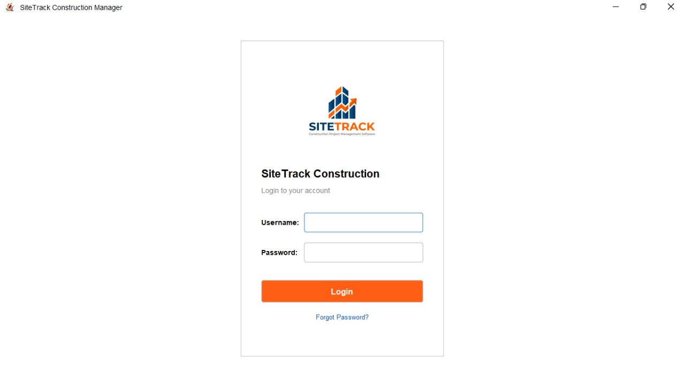
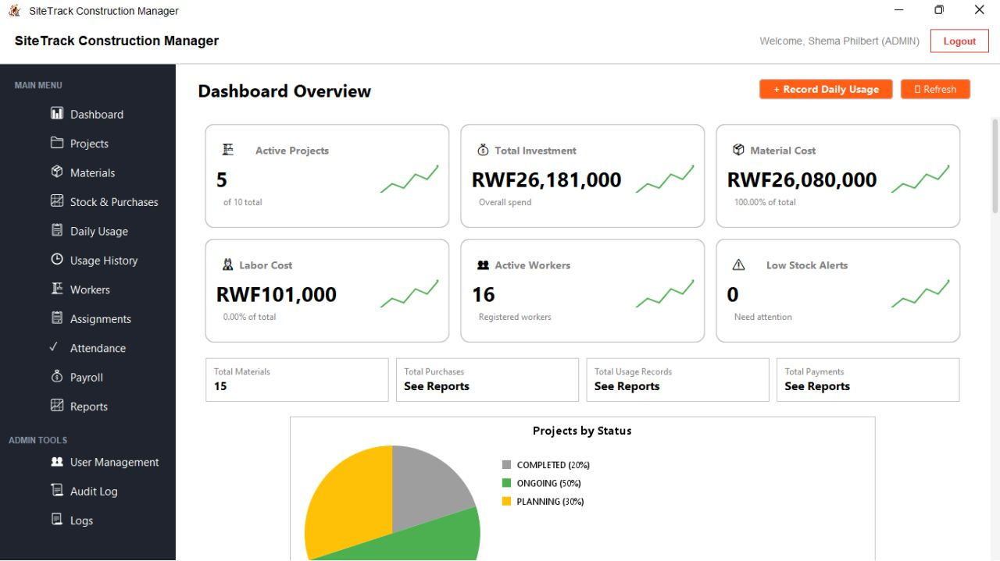
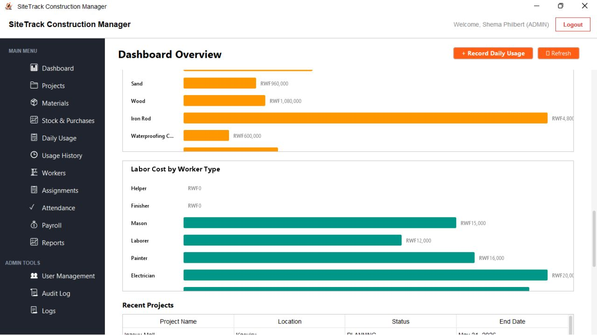
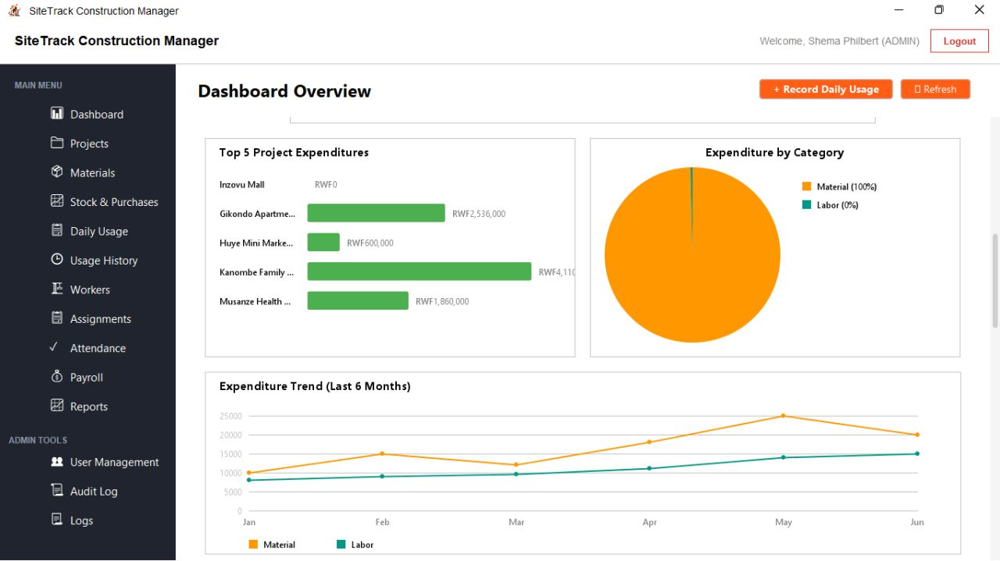
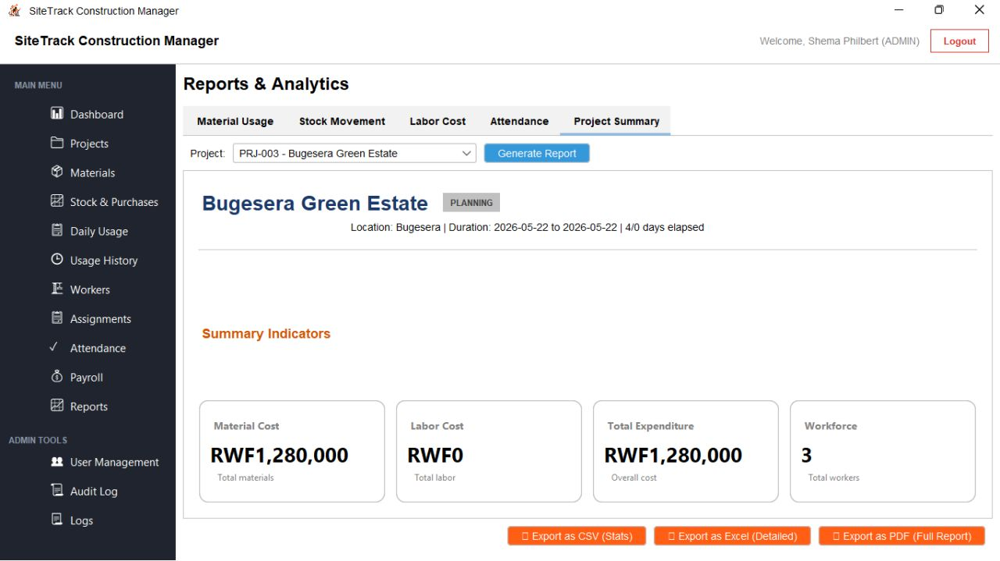

# SiteTrack Construction Project Management System

SiteTrack Construction Manager is a distributed, enterprise-grade resource management system designed to track and manage materials, activities, and labor across multiple active construction sites. 

The application utilizes a distributed MVC & DAO architecture enforcing strict role-based access control, secure RMI communication (zero direct database access for clients), Hibernate ORM database interaction, and asynchronous notification dispatching via a message broker.

---

## 📸 Application Preview (Screenshots)

### 1. Secure Orange-Themed Login Portal
Features 2FA authentication requiring a 6-digit One-Time Password (OTP) generated upon correct credentials submission.


### 2. Main Dashboard Overview
Provides global insights into active projects, overall investments, material vs. labor expenses, active workforce count, and active low-stock alerts.


### 3. Material & Labor Expense Breakdowns
Displays detailed horizontal bar charts categorizing material expenditures, labor costs, and a list of recent projects with status updates.


### 4. Expenditure Trends & Category Allocations
Visualizes a 6-month historical expenditure trend (Material vs. Labor) and category ratios.


### 5. Reports & Analytics Portal
Generates printable summaries for projects including CSV, Excel, and PDF formats.


---

## 🛠️ Technology Stack

*   **Communication Layer**: Java RMI (Remote Method Invocation) on a configurable registry port (default: `4567`)
*   **Client GUI**: Java Swing styled using the modern **FlatLaf Light** look & feel
*   **Database & ORM**: PostgreSQL (`site_track_construction_manager`) with **Hibernate 4**
*   **Message Broker**: Apache ActiveMQ / RabbitMQ for asynchronous OTP delivery and low-stock alerts
*   **Development / Build Tools**: NetBeans IDE structure with Apache Ant `build.xml` scripts

---

## 🚀 How to Run the Project

Follow these instructions to set up, configure, and launch both the Server and Client components.

### 📋 Prerequisites
Before getting started, make sure you have the following installed on your machine:
*   **Java JDK 8 or higher** (JDK 8 or JDK 11/17/21 are fully compatible)
*   **PostgreSQL DBMS**
*   **Apache ActiveMQ** message broker
*   **An IDE** (Apache NetBeans, IntelliJ IDEA, or VS Code with Java extensions) or **Apache Ant** (if running via command-line)

---

### Step 1: Database Setup
1. Start your PostgreSQL server.
2. Create a new database named `site_track_construction_manager` using `psql` or `pgAdmin`:
   ```sql
   CREATE DATABASE site_track_construction_manager;
   ```
3. Open a SQL query terminal against your newly created database and execute the schema initialization & seed script located in:
   `SiteTrackServer28279/seed.sql`
   This will seed materials, categories, worker types, site workers, and demo projects.

---

### Step 2: Start the Message Broker (ActiveMQ)
The Server relies on Apache ActiveMQ to queue and process login OTPs and stock alert notifications.
1. Download and extract [Apache ActiveMQ](https://activemq.apache.org/).
2. Run the broker daemon:
   *   **Linux / macOS**: `./bin/activemq start`
   *   **Windows**: `.\bin\win64\activemq.bat`
3. Ensure the service is accepting connections at the standard queue port: `tcp://localhost:61616`.

---

### Step 3: Configure and Run the Server Application (`SiteTrackServer28279`)
The server serves as the system's brain, hosting all database handlers (DAOs), entities, and RMI service implementations.

1.  **Configure Database Connections**:
    *   Open [SiteTrackServer28279/src/hibernate.cfg.xml](file:///data/projects/other/SiteTrack-ConstructionProjectMS/SiteTrackServer28279/src/hibernate.cfg.xml).
    *   Set the database username and password corresponding to your local PostgreSQL installation:
        ```xml
        <property name="hibernate.connection.username">your_username</property>
        <property name="hibernate.connection.password">your_password</property>
        ```
2.  **Configure RMI & Email properties**:
    *   Open [SiteTrackServer28279/src/config.properties](file:///data/projects/other/SiteTrack-ConstructionProjectMS/SiteTrackServer28279/src/config.properties).
    *   Modify `rmi.port` (must be between `3000` and `6000`), `rmi.hostname` (`127.0.0.1` for local setup), and SMTP configurations for OTP emails.
3.  **Run the Server**:
    *   **Via NetBeans**: Right-click the `SiteTrackServer28279` project and click **Clean and Build**, then right-click and click **Run**.
    *   **Via Command Line (Ant)**:
        ```bash
        cd SiteTrackServer28279
        ant compile
        ant run
        ```
    *   *Upon startup, the server console should log that the Hibernate SessionFactory is initialized and 14 RMI services are registered successfully on your port.*

---

### Step 4: Configure and Run the Client Application (`SiteTrackClient28279`)
The client operates the graphical user interface. It communicates exclusively via RMI stub lookup.

1.  **Configure Client Server-Link**:
    *   Open [SiteTrackClient28279/src/config/config.properties](file:///data/projects/other/SiteTrack-ConstructionProjectMS/SiteTrackClient28279/src/config/config.properties).
    *   Make sure `rmi.server.port` matches the port specified in the Server's configuration (default: `4567`).
2.  **Resolve Classpath Dependencies**:
    *   The Client project relies on several libraries (FlatLaf 3.7.1, JCalendar 1.4, iTextPDF, Apache POI, and the Server JAR itself). Ensure these are referenced correctly inside your IDE from your local path.
3.  **Run the Client**:
    *   **Via NetBeans**: Open the project, ensure dependencies are loaded, clean & build, and **Run**.
    *   **Via Command Line (Ant)**:
        ```bash
        cd SiteTrackClient28279
        ant compile
        ant run
        ```

---

## 🔑 Testing Credentials & 2FA Bypass

Once the application is running, you can log in using these pre-seeded accounts:

| Role | Username | Password |
| :--- | :--- | :--- |
| **Admin** | `shema` | `disaster` |
| **Site Manager** | `tricia` | `manager123` |

### 🔒 Bypass OTP Verification
1. Log in with either credentials.
2. Since SMTP / ActiveMQ email configuration is required to receive the OTP on your real email address, you can easily read the code directly from the database when testing locally:
   ```sql
   SELECT otp_code FROM otp_verifications ORDER BY created_at DESC LIMIT 1;
   ```
3. Type the fetched 6-digit code into the OTP verification dialogue to complete your login.

---

## 📁 Project Structure

```
SiteTrack-ConstructionProjectMS/
├── SiteTrackServer28279/        # Backend RMI server (Hibernate & Database layer)
│   ├── src/
│   │   ├── model/               # JPA Hibernate entity classes
│   │   ├── dao/                 # Data Access Object implementations
│   │   ├── service/             # RMI service interfaces & implementations
│   │   ├── util/                # DB connections, activemq producers, and security utilities
│   │   ├── hibernate.cfg.xml    # Database connectivity details
│   │   └── config.properties    # RMI, mail, and system configs
│   ├── seed.sql                 # Database seeds SQL
│   └── build.xml                # Ant build configuration
│
├── SiteTrackClient28279/        # Frontend Swing user interface
│   ├── src/
│   │   ├── view/                # FlatLaf JFrame panels & view controllers
│   │   ├── config/              # RMI client connector & config properties
│   │   └── Client.java          # Client launcher entry-point
│   └── build.xml                # Ant build configuration
│
└── screenshoots/                # UI Screenshot assets
```

---

## 🛡️ Critical Business Rules
1.  **Material Purchasing**: Adding a purchase increases stock, recalculates the average unit price with a weighted average method, and inserts an audit log trail.
2.  **Material Outflow (Usage)**: Adjusts stock downwards and rejects any requests exceeding current stock inventory.
3.  **Labor Wages**: Payroll can only be logged for workers on dates they are explicitly verified as `PRESENT` in the attendance records.
